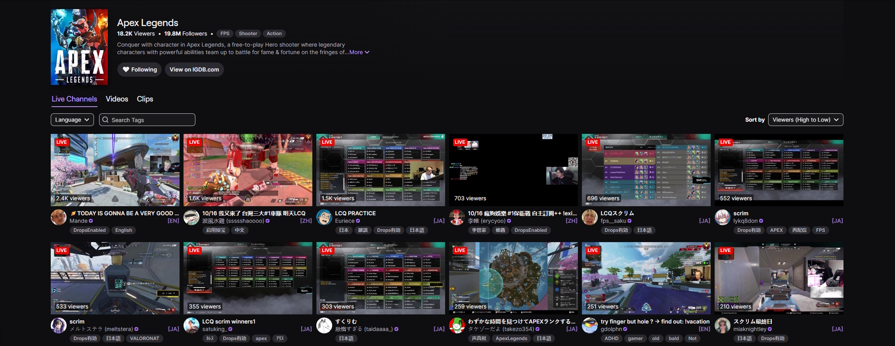
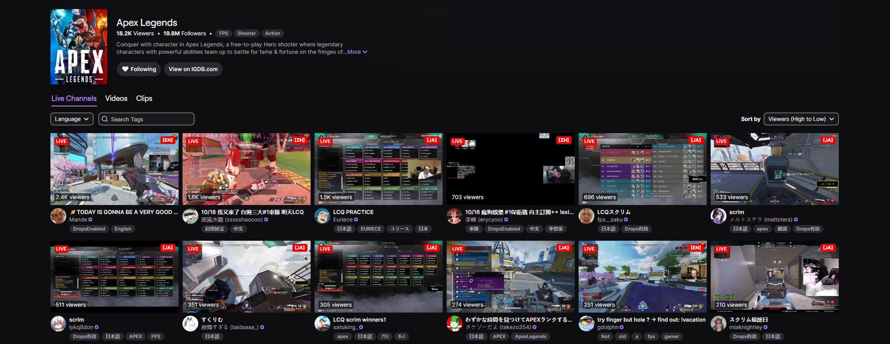
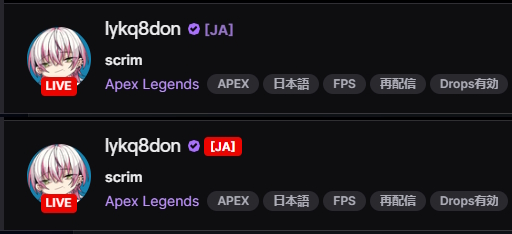

<h1 align="center">
Twitch - Show Stream Language
</h1>

Userscript for browsers that displays stream’s language code like **[EN] / [JA] / [ES]** right in the Twitch UI.
Works on channel preview cards in directories and on the channel page header itself.
Two visual modes are available: a **top‑right badge** on the card or a **right‑aligned suffix** next to the streamer's username.

## ✨ Features

- Detects and shows the stream language (ISO‑like two‑letter codes and common locale variants).
- Two visual modes:
  - **suffix** — small label aligned to the right of the streamer's username.
  - **badge** — compact pill in the top‑right corner of a preview card.  
- Works across SPA navigations (React router) and on initial load.
- Annotates both **directory/browse** cards and the **channel header**.
- Has several fallbacks when language cannot be determined from GQL.

## 🖼 Screenshots

### Suffixes next to streamers’ usernames



### Badges on channel preview cards



### Suffix or badge on the stream page



## 🚀 Installation

1. Install [Tampermonkey](https://www.tampermonkey.net/) (or another userscript manager).
2. Install the script from one of the mirrors:
   - [GreasyFork](https://greasyfork.org/en/scripts/552795-twitch-show-stream-language)
   - [OpenUserJS](https://openuserjs.org/scripts/Vikindor/Twitch_-_Show_Stream_Language)
   - Or [install directly from this repository](./Twitch_-_Show_Stream_Language.js).

## 🔧 Configuration

Open the script in your userscript manager and change the value of:

```js
const VISUAL_MODE = 'suffix';
```

suffix - adds label next to the streamer's username.

badge - adds small pill in the top-right corner of the preview card.

## ⚙ How it works

The script passively listens to Twitch’s SPA updates and XHR GQL responses, extracts language info from fields like `broadcasterLanguage`, `language`, and content tags, and maps localized tag names to ISO‑like codes when needed. It then annotates relevant DOM nodes as they appear.

## ❗ Note

In rare cases, you may see a **[??]** suffix — this happens when the stream has no language set in GQL and no recognizable custom tags to infer it from. This is a known issue and I’m exploring possible ways to improve detection; it may be resolved in future updates.